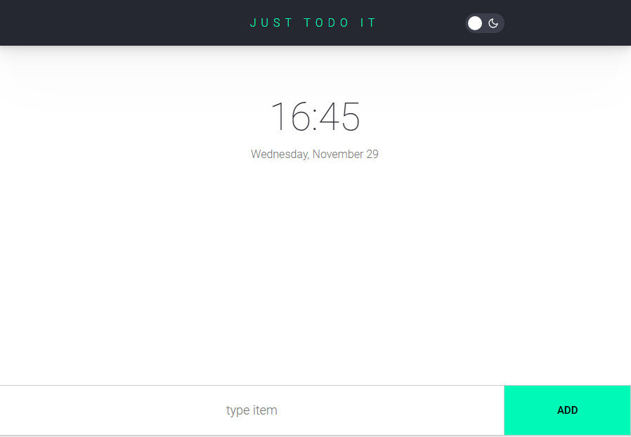
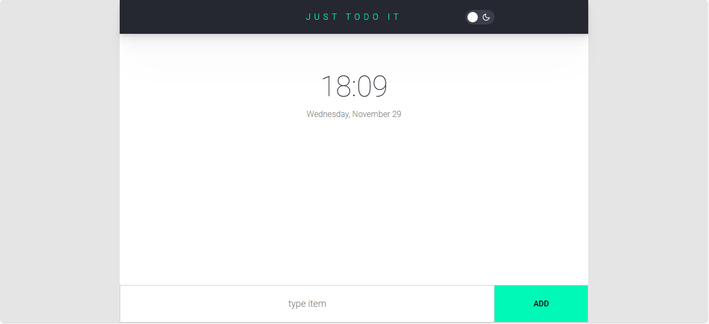
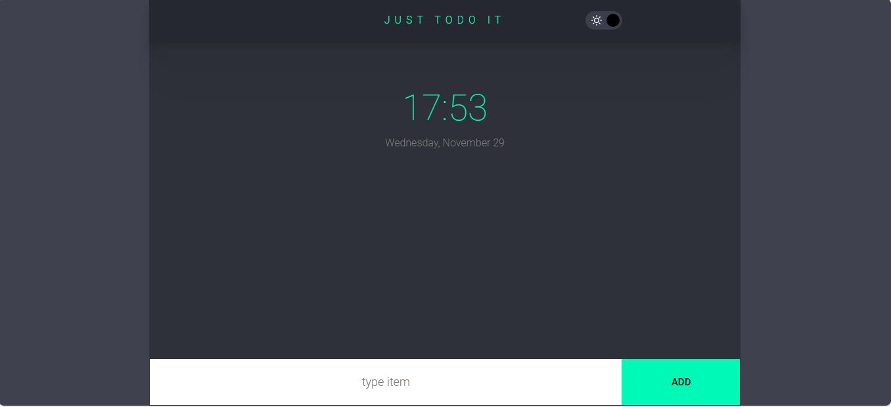
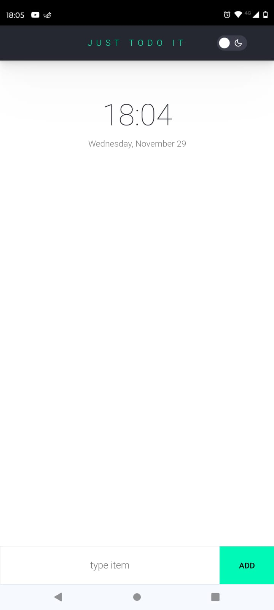
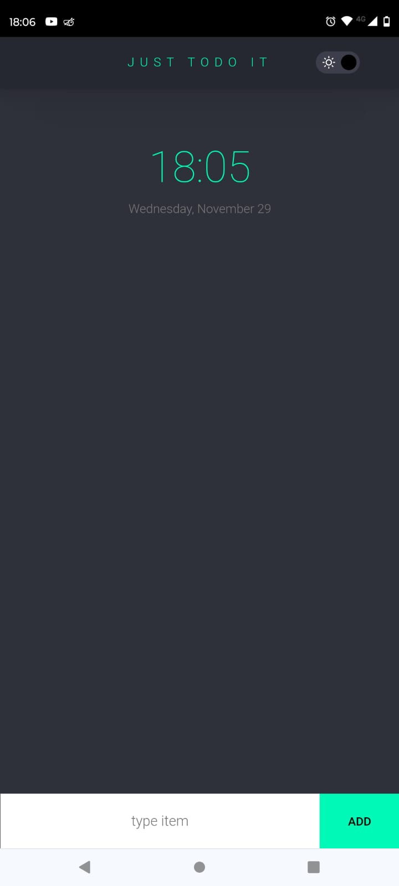

# Proyecto Lista de tareas

Este proyecto, denominado TO-DO-LIST, fue desarrollado como parte del curso Desarrollador ReactJS impartido por la UTN FRBA a través de Argentina Programa 4.0, y fue asignado por nuestro tutor como trabajo integrador final del curso. 

## Contenido

- [Demostración](#demostración)
- [Descripción](#descripción)
- [Tecnologías Utilizadas](#tecnologías-utilizadas)
- [Capturas de Pantalla](#capturas-de-pantalla)
- [Instalación](#instalación)
- [Uso](#uso)
- [Licencia](#licencia)

## Demostración

[TODOLIST DEMO](https://todolist-adf.netlify.app/)

## Descripción

El proyecto final se centra en la creación de una aplicación para gestionar una lista de tareas en base a una imagen de diseño la cual se debe replicar con exactitud en principio pudiendo agregar más funcionalidades después. La aplicación utiliza componentes de React, el hook useState para el manejo del estado, useEffect para realizar efectos secundarios y eventos para interactuar con el usuario.La persistencia de datos se logra mediante localStorage, permitiendo que las tareas persistan incluso después de recargar la página.

Los usuarios pueden agregar nuevas tareas, marcarlas como completadas y eliminarlas, proporcionando así una experiencia de gestión de tareas intuitiva. Agregamos también un switch que permite cambiar entre modo oscuro y modo claro con una transición suave entre ambos modos.

## Tecnologías Utilizadas

 
 

## Capturas de Pantalla

**Pantallas Grandes**

**Dark Mode en Pantallas Grandes**

**Pantallas Pequeñas**

**Dark Mode en Pantallas Pequeñas**

## Instalación

1. Clona el repositorio: `git clone https://github.com/alexis-ramos-ok/to-do-list.git`
2. Navega al directorio del proyecto: `cd TO-DO-LIST`
3. Instala las dependencias: `npm install`

## Uso

Inicia la aplicación: `npm start`

La aplicación estará disponible en [http://localhost:3000](http://localhost:3000) en tu navegador.

## Licencia

Agradecemos a todos los desarrolladores que se sumergirán en este proyecto y explorarán el código. Este proyecto no solo representa el aprendizaje y la dedicación de quienes lo crearon, sino también la enseñanza invaluable del curso que proporcionó las bases para su desarrollo. ¡Gracias por formar parte de esta comunidad de aprendizaje y desarrollo!
